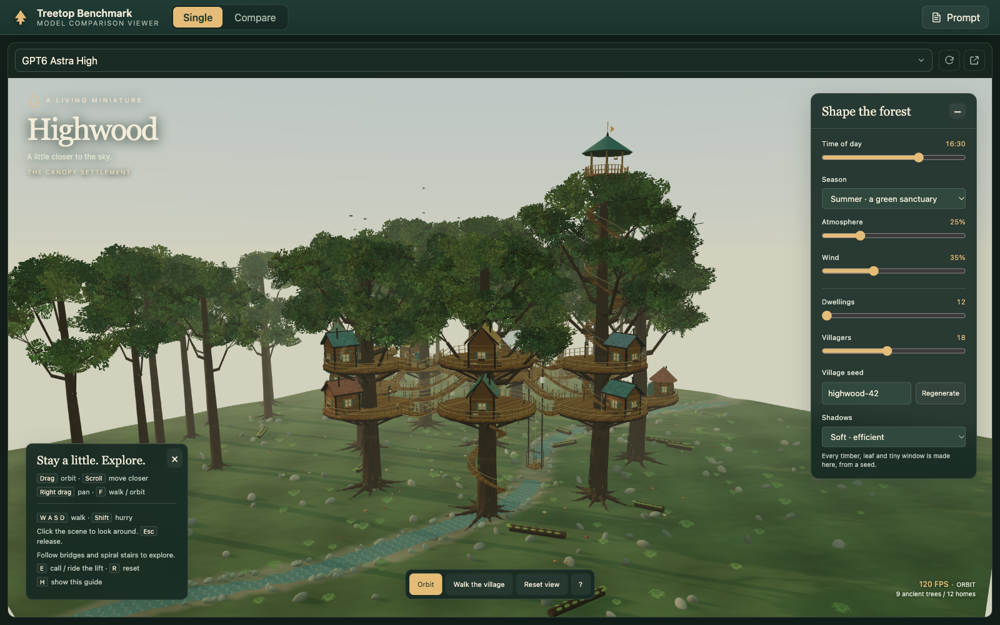
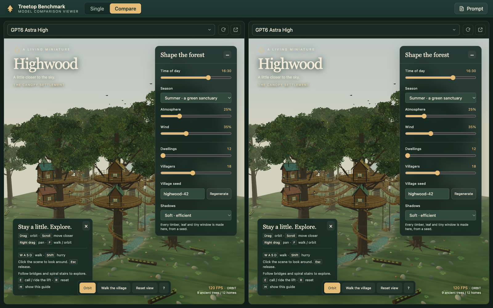
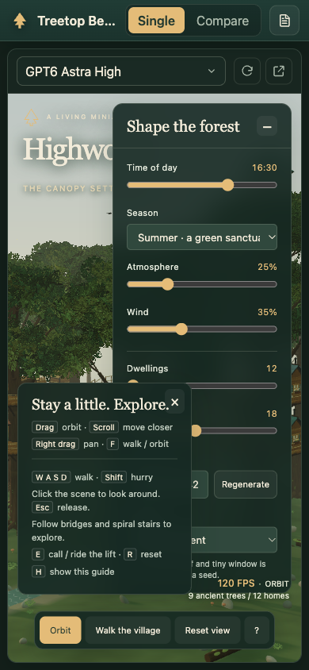

<div align="center">

# 🌲 Treetop Benchmark Viewer

### Browse and compare the 3D treetop villages your models build, side by side.

A fast, zero-dependency local viewer for judging the single-file HTML scenes produced by the Treetop benchmark.
Load any model full screen, or put two next to each other and let your eyes do the scoring.

<br />

[](https://www.python.org/)
[](#why-its-fast-and-simple)
[](https://threejs.org/)
[](web/app.js)
[](LICENSE)

</div>

<br />

<div align="center">
  
</div>

<br />

## Contents

- [What it does](#what-it-does)
- [Quick start](#quick-start)
- [Usage](#usage)
- [Screenshots](#screenshots)
- [Adding a model](#adding-a-model)
- [How it works](#how-it-works)
- [Project layout](#project-layout)
- [The benchmark](#the-benchmark)
- [License](#license)

<br />

## What it does

Each model run in this benchmark is a single, self-contained HTML file: an interactive 3D treetop village built with three.js, generated entirely in code with no external assets.
Comparing a dozen of these by hand means juggling browser tabs and losing track of which is which.

This viewer fixes that.

- 🪟 **Single mode** puts one model full screen so you can explore it in detail.
- ⚖️ **Compare mode** places two models side by side, each with its own picker, so differences jump out.
- 📱 **Fully responsive**, from an ultrawide monitor down to a phone: the compare panels stack and the chrome collapses gracefully.
- 🔄 **Reload** restarts a scene in place, handy for re-rolling a random seed.
- ↗️ **Open in new tab** launches a model on its own for a true full-window performance test.
- 📜 **Prompt panel** keeps the full benchmark brief one click away while you judge.
- ➕ **Drop-in models**: add an HTML file to `models/`, refresh, and it appears. No config, no build.

<br />

## Quick start

> **Requirement:** Python 3.10 or newer. Nothing else. No `pip install`, no `npm install`.

```bash
# from the project root
python3 server.py
```

Then open the URL it prints:

```
http://localhost:8777/
```

Prefer a different port? Pass it as an argument:

```bash
python3 server.py 9000
```

<br />

## Usage

| Control | What it does |
| --- | --- |
| **Single / Compare** | Switch between one full-screen model and two side by side. |
| **Model dropdown** | Choose which model fills a panel. Each panel is independent. |
| **🔄 Reload** | Restart that model's 3D scene in place. |
| **↗️ Open in new tab** | Open the raw model on its own for full-window testing. |
| **📜 Prompt** | Slide out the full benchmark prompt. Dismiss with the close button, the backdrop, or `Esc`. |

Every model renders inside its own `<iframe>`, so two scenes run fully isolated, each with its own WebGL context, without interfering with one another or the app shell.

<br />

## Screenshots

**Compare mode** - two independent scenes, each with its own controls:

<div align="center">
  
</div>

<br />

**Responsive** - the same app on a phone, panels stacked and chrome collapsed:

<div align="center">
  
</div>

<br />

## Adding a model

1. Drop a self-contained `.html` file into the `models/` folder.
2. Refresh the page.

That is the whole workflow.
The server reads the folder live on every request, so new models appear with no restart and no manifest to regenerate.

Filenames become clean display labels automatically.
A leading `Treetop_village_` prefix is stripped, the extension is dropped, and underscores become spaces:

```
Treetop_village_GPT6_Astra_High.html   ->   GPT6 Astra High
```

<br />

## How it works

The whole app is three small static files served by one tiny Python script.

```
Browser  ──GET /──────────────▶  server.py  ──▶  web/index.html + style.css + app.js
         ──GET /api/models────▶              ──▶  live JSON listing of models/
         ──GET /models/<file>─▶              ──▶  the raw model HTML (loaded in an iframe)
         ──GET /api/prompt────▶              ──▶  prompt.txt
```

### Why it's fast and simple

- **Zero third-party dependencies.** The server is pure Python standard library (`http.server`). The frontend is vanilla HTML, CSS, and JavaScript with no framework and no build step.
- **Live folder listing.** `GET /api/models` reads `models/` on every request, so the model list is never stale.
- **Isolation by design.** Each model is a full HTML document, so rendering it in an `<iframe>` gives every scene its own window, document, and WebGL context.
- **Safe by default.** The server only serves known frontend files plus files that resolve inside `web/` and `models/`, and it rejects directory-traversal paths.

<br />

## Project layout

```
treetop_benchmark/
├── server.py                 # zero-dependency local server (stdlib only)
├── web/
│   ├── index.html            # app shell
│   ├── style.css             # warm, dark, canopy-themed UI
│   └── app.js                # model loading, modes, prompt panel
├── models/                   # drop model .html files here
│   └── Treetop_village_*.html
├── assets/                   # screenshots for this README
├── docs/                     # design spec
├── prompt.txt                # the benchmark prompt
├── LICENSE
└── README.md
```

<br />

## The benchmark

`prompt.txt` holds the full brief given to each model.
In short, it asks for a single self-contained HTML file that renders an interactive, highly detailed 3D treetop village:
at least seven giant trees, a dozen varied dwellings, swaying rope bridges, a day/night and seasons control panel, orbit and first-person camera modes, and a steady 60fps, all generated procedurally with three.js r170 and zero external assets.

The full criteria are in the file, and the **Prompt** button surfaces them inside the viewer while you judge.

<br />

## License

Released under the [MIT License](LICENSE).

<br />

<div align="center">
  <sub>Built for the Treetop benchmark · <a href="https://github.com/markstent/treetop_benchmark">github.com/markstent/treetop_benchmark</a></sub>
</div>
